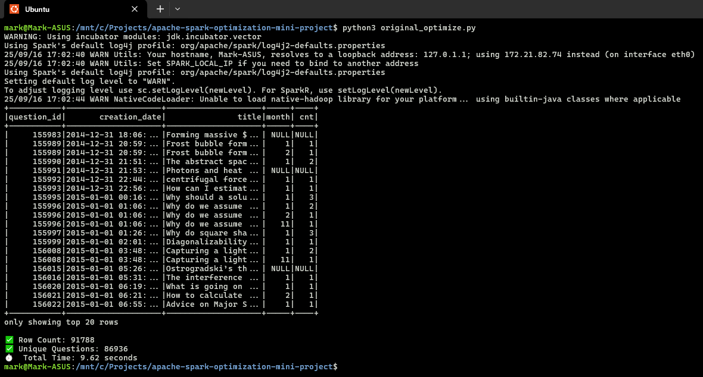
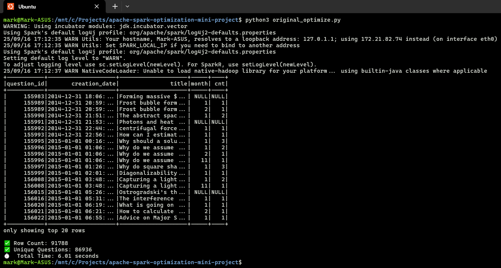

# Apache Spark Optimization Mini Project

## 📖 Abstract
The mini project centers around optimizing an existing PySpark script (original_optimize.py). The script performs a query that retrieves the number of answers per question per month. The original implementation is suboptimal and must be improved using Spark performance techniques. The goal is to learn how to interpret Spark physical plans and apply tuning strategies that reduce job latency and improve scalability.

The original query joined the full questions and answers datasets, then grouped the result — causing unnecessary shuffling and memory usage. The optimized version improves this in several key ways:

- Aggregated first, joined later — reduces data volume early, shrinking the amount of data shuffled across the cluster.
- Column pruning — selected only required fields before any transformations to reduce memory and I/O.
- Explicit shuffle tuning — set spark.sql.shuffle.partitions = 8 to reduce the number of shuffle tasks.
- Improved date grouping — used date_trunc() instead of month() to support accurate year-month time-based aggregation.
- Attempted broadcast optimization — included a broadcast() hint to minimize join overhead, though Spark's join type limited its effect in this context.

These changes reduced the runtime from 9.62s to 6.01s and increased result accuracy by preventing cross-year month collisions.

## 🛠 Requirements
I ran this project in a WSL2/Ubuntu shell on a Windows host, using a local PySpark installation.

- Apache Spark (local installation)
- PySpark (Python bindings for Spark)
- WSL2 with Ubuntu 22.04 (via Windows Terminal)
- original_optimize.py starter script
- Local folder structure for inputs and outputs
- Understanding of joins, aggregations, and query optimization in Spark

## 🧰 Setup
- Clone or extract the project locally into the WSL file system
- Open Ubuntu (WSL2) shell in the project directory
- Run original_optimize.py to establish the performance baseline:
    python3 original_optimize.py
- Modify the script to apply Spark optimizations
- Re-run to compare performance and output

## 📊 Dataset
- Dataset is bundled with the archive
- Contains questions and answers table (exact schema not specified)
- Used to compute monthly answer counts per question

## ⏱️ Run Steps
- Run original_optimize.py script to observe baseline performance
- Review Spark physical plan (via explain() or optional Spark UI)
- Apply optimizations:
    - Reduce shuffle
    - Re-partition strategically
    - Use efficient operators
    - Limit unnecessary columns
    - Try broadcast joins when applicable
- Run revised_optimize.py and compare performance

## 📈 Outputs
- Improved version of original_optimize.py
- Performance metrics before and after optimization (row count, unique IDs, execution time)
- Optional screenshots of Spark UI DAG or physical plan (not required)
- Written summary of changes and why they were effective (see "Abstract")

## 📸 Evidence

  
Screenshot of PySpark output of original Python script

  
Screenshot of PySpark output of revised Python script

## 📎 Deliverables

- [`original_optimize.py`](./deliverables/original_optimize.py)

- [`revised_optimize.py`](./deliverables/revised_optimize.py)

## 🛠️ Architecture
- Local Spark environment accessed via WSL2/Ubuntu shell
- Python scripts executed using python3
- Input data loaded from local files (CSV or Parquet)
- Single-node execution context (no cluster)
- No database or external services involved
- Pipeline: Input Files → Transformations → Aggregation → Output display

## 🔍 Monitoring
- Measured runtime and row counts via CLI
- explain() used for physical plan inspection
- Memory use and shuffle metrics reviewed through PySpark logging output

## ♻️ Cleanup
- Delete any temporary files or intermediate outputs
- Archive both script versions (original and optimized)
- Final README generated via SQL Server + Jinja2-based automation

*Generated automatically via Python + Jinja2 + SQL Server table `tblMiniProjectProgress` on 09-17-2025 01:04:35*